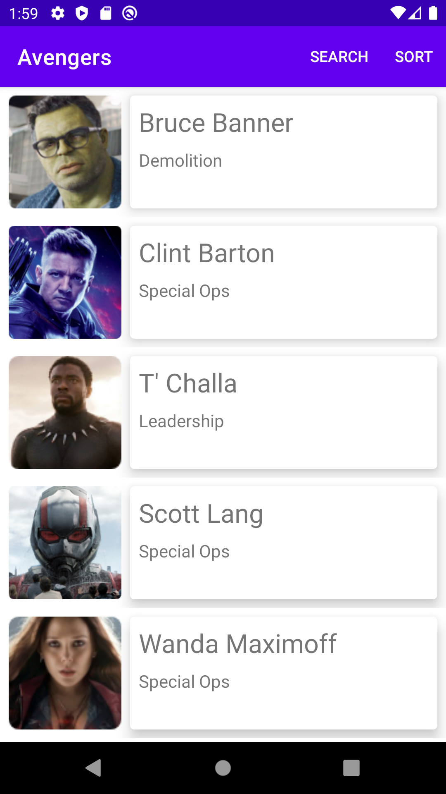

# Avengers Android App
## Project Overview
This is an MVI sample app I like to keep around for trying out different approaches to databases, architecture components, asynchronous programming, etc.


Recently I also started cropping images using facial recognition. Google's ML-Kit made this fairly simple.



## All app features:
- Single Activity App
- Beautiful UI with Material Design
- MVI
- Hilt Dependency Injection
- Navigation Component with smooth fragment slide-in / slide-out animations
- Cached images with Coil
- Repository pattern with Retrofit2 and a SQLDelight for the local database
- 6 hour cache invalidation strategy (unless you force a download with Swipe-Refresh)
- Sorting employees by first name, last name, or team
- Search for employees across all fields
- Auto-call employee
- Auto-email employee
- Master - Detail for Phone (Click an employee, and go to their full info page)
- Master - Detail for Tablet
- Error handling
- Empty response handling

## Architectural Approach
I am very passionate about Android, and I always want to push myself to learn more. 
Recently, I finished some courses on MVI, Dagger and Hilt, and wanted to put my new
knowledge to the test. I'm comfortable with MVVM, but MVI (Model-View-Intent) is still 
somewhat new to me. I'm really glad I went with MVI, though. The initial scaffolding 
setup took a long time, but after it was set up, adding new features, such as search 
and sort, was really easy.

I mostly focused on architecture. I really love app architecture, and the idea of investing
a lot of time up front to save more time later on is very appealing. MVI is great here 
for a couple reasons:
1. There is only 1 way to interact with the ```ViewModel```, via a ```setState()``` method
which accepts a finite number of inputs through ```sealed classes```. By keeping its 
```MutableLiveData```'s private, we can be sure that the ```ViewModel``` is the only one
who can mutate it. Then we can expose is via a (non-mutable) ```LiveData```.
1. There is only 1 way for the ```ViewModel```'s view state to be observed, again by using
```sealed class```s to constrain possible view states. This is much better than observing
individual fields. We can instead wrap them all in one view state or another, and the
```Fragment``` (or ```Activity```) can have one method to render it.

When ```ViewModels``` have 1 way in and 1 way out, we've achieved unidirectional data flow,
the aim of MVI. This is in marked contrast to MVVM, where anyone can observe and post to any ```MutableLiveData``` it 
exposes.

## Technologies

### Android Studio 4.2 canary 13

### Kotlin
Kotlin gives us access to coroutines, flow, extension properties on ```Activity```, ```Fragment```,
```ViewModel``` and more. Also, because Kotlin is the future for programming in many domains try to use Kotlin whereever I can,
even in my Gradle build files. 

### KotlinX Native Serialization
I previously used Moshi, following this recommendation of one of the authors of both Moshi and Gson:
https://www.reddit.com/r/androiddev/comments/684flw/why_use_moshi_over_gson/dgx3gpm/
But now, I'm using Kotlin native serialization, as it's multiplatform ready.

### SQLDelight
Unlike Room, SQLDelight is type safe for all kinds of queries, has multiplatform support, and supports different databases besides just SQLite. I don't like that SQLDelight doesn't have an option for a simple suspend function, but this is apparently for a [good reason](https://github.com/cashapp/sqldelight/issues/1420). ```Flow.asSingle()``` works fine.

### Retrofit2
Duh.

### LiveData
Mostly using Flow here. Using LiveData now only for setting the current Employee. This part is a little dirty, but the normal methods didn't work well with NavigationComponent. There is a different nav graph for portrait and landscape, so safe args only work for portrait mode. In landscape mode, you can't even check if args == null; you'll get a crash by just referencing the safe args. 

### Coil
The performance of Coil is not as good as Glide, but it's really lightweight, more idiomatic, and reuses many common 
shared dependencies for Android apps. The first image load is similar to Picasso, and the cached load is similar to 
Glide. https://proandroiddev.com/coil-vs-picasso-vs-glide-get-ready-go-774add8cfd40

I also implemented a Coil transformation ```CenterOnFaceTransformation```, which uses MLKit Face Detection to find the most prominent face in the image, and zoom the desired amount. It'll be available [here](https://github.com/Commit451/coil-transformations/tree/master/transformations-face-detection) in the future.


### Flow
Flow lets me emit multiple values for each execution. This is really helpful with MVI, when you want to ```emit``` a
"Loading" state before the actual success / error response. I'm not going with RxJava because it's not lifecycle-aware,
and I don't want to worry about job cancellation, even if I collect them all into a  ```CompositeSubscription```. The
RxJava2 library is pretty large, too. Flow has a growing list of similar functional transformations as well, so I don't
feel I'm missing anything I need.

### Hilt
Dagger2 is really hard to learn, and it's easy to mess something up. Other options such as Koin and Kodein are more
idiomatic, but suffer from performance / reflection issues. Hilt is the best of both worlds: uses Dagger2 under the 
hood, so it's extremely fast, and checked at compile-time, but also really easy to use. For testing, we can also
substitute part of the dependency graph with fakes instead of mocks. Hilt is a no-brainer.

### Jetpack Navigation
Navigation Component means I don't need to manually create my own ```FragmentTransaction```'s, which is great. The 
```NavigationController``` handles that for me, once it has the nav graph. Unfortunately, I spent many hours trying to
do something tricky, integrating the master-detail flow with the NavigationComponent. I thought about replacing the main
```NavigationController``` or the ```MainActivity``` or the ```EmployeeListFragment``` using qualified xml resources. 
I don't think any of those techniques were good solutions. Instead, I found GDE Lara Martin's article on master-detail
with Navigation Component, and emulated her approach. https://proandroiddev.com/master-detail-views-with-navigation-components-a20405f31974
And thanks to her article, it turned out fantastic.

### Material Design
I needed those slick ```CardView```'s and ```MaterialButton```'s. Simplicity is key.

## Biggest Challenges

As stated previously, combining the master-detail phone and tablet modes while using ```NavigationComponent``` was very
tricky. Also, handling navigation events as a value that can only be read once, was a little tricky. I was caught in a
loop of re-navigating to the detail page whenever I pressed back. This is because the navigate-to state was being 
re-read (observed) every time we navigated back. The ```Event``` class I copied from Mitch Tabian, and allows me to consume a 
navigation event only once, which handles this issue well.

SharedElementTransitions were also tricky. A lot of the difficulties with SharedElementTransition went away when I converted to DataBinding, and set the transition names in XML.

## Citations
Many techniques used here I have learned in Mitch Tabian's Android courses, and GDE Lara Martin's Master-Detail approach
was critical to the success of this project.
 
### I copy-pasted from:
- (Lara Martin) the ```Guideline``` ```View``` for Master-Detail UI
- (Mitch Tabian) the slide-in / slide-out animations
- (Mitch Tabian) the ```Cardview``` elevation and corner radius attributes
- (Mitch Tabian) the ```Event``` class (can only be read only once)
- (Mitch Tabian) the ```DataState``` class, and added a couple more child objects for my use cases.
- (StackOverflow) copied and modified the LinkedIn sharing from: https://stackoverflow.com/questions/9730243/how-to-filter-specific-apps-for-action-send-intent-and-set-a-different-text-for 


### I used a general technique from:
- (Lara Martin) getting around ```NavigationComponent``` / Master-Detail compatibility issues
- (Mitch Tabian) Use a ```FragmentFactory``` so we can ```@Inject``` into ```NavHostFragment```s
- (Mitch Tabian) different models for network responses and the local database
- (Mitch Tabian) Efectively using the repository pattern
- (Mitch Tabian) MVI in general

### Other Borrowed Things
- This project was originally the Master-Detail Template from Android Studio. It wasn't as helpful as I thought it'd be.
I transitioned it gradually until I had ripped it all out.

## Future considerations
I've added some unit testing of the mapping functions to and from domain models. This app needs more 
unit, integration, and ui testing, and there will be plenty in subsequent versions.

Another piece of low-hanging fruit is better caching using pre-fetching. Right now, both low and high quality images are
cached when requested, which is great. But, we can also cache them before they're needed. When we request a small image 
within the ```EmployeeViewHolder```, we can fire a job for ```WorkManager``` to handle robustly. Our custom 
Coroutine worker could call Coil's preload method: https://coil-kt.github.io/coil/getting_started/#preloading

Adding a search cache shouldn't be hard either, and would be a valuable add-on.

There is also a lot of boilerplate with MVI. I would like to go back in there and use the Kotlin ```Result``` library to 
eliminate some of it, and add some rails-oriented-programming for easier-to-track states. Adam Bennet's talk on the
Result Monad at the worldwide Boston Android Meetup and its accompanying blog (https://adambennett.dev/2020/05/the-result-monad/) 
were very compelling.

